# Cesco Deskroom - Comprehensive Entity Relationship Diagram

## Database Overview
- **Primary Database**: `deskroom_core`
- **Secondary Database**: `prefect_db` (workflow management)

## Schema Structure

```mermaid
erDiagram
    %% SOURCE SCHEMA - Raw Data Tables

    source_message {
        BIGSERIAL id PK
        VARCHAR(50) RCNO
        TIMESTAMPTZ received_at
        VARCHAR(50) CCOD
        TEXT content
        TIMESTAMPTZ created_at
        TIMESTAMPTZ updated_at
    }

    source_user_monthly_features {
        BIGSERIAL snapshot_id PK
        VARCHAR(50) CCOD
        DATE snapshot_month PK "partition_key"
        JSONB contract_info
        JSONB user_information
        JSONB purchase_logs
        JSONB interaction_history
    }

    source_industry_codes {
        BIGSERIAL id PK
        VARCHAR(50) code
        VARCHAR(255) name
        TIMESTAMPTZ created_at
        TIMESTAMPTZ updated_at
    }

    source_voc_category {
        BIGSERIAL id PK
        TIMESTAMPTZ created_at
        TIMESTAMPTZ updated_at
        VARCHAR(50) voc_id UK
        VARCHAR(255) name
        VARCHAR(50) parent_id FK
        INTEGER level
    }

    source_potential_user {
        BIGSERIAL id PK
        DATE snapshot_month PK "partition_key"
        VARCHAR(50) KEDCD
        VARCHAR(50) BZPL_CD
        VARCHAR(50) BZPL_SEQ
        VARCHAR(50) BZNO
        VARCHAR(255) ENP_NM
        TIMESTAMPTZ created_at
        VARCHAR(100) SIDO
        VARCHAR(100) SIGUNGU
        FLOAT LAT
        FLOAT LOT
        VARCHAR(255) BZPL_NM
        VARCHAR(50) BF_BZC_CD
        FLOAT BSZE_METR
        FLOAT LSZE_METR
        VARCHAR(500) RDNM_ADDR
    }

    %% ANALYTICS SCHEMA - Derived Analytics Tables

    analytics_user_monthly_property {
        VARCHAR(255) CCOD PK
        TIMESTAMP created_at PK "partition_key"
        INTEGER unique_work_types
        INTEGER cancelled_work
        REAL cancellation_rate
        REAL confirmation_rate
        REAL avg_services_per_work
        INTEGER work_last_30d
        INTEGER confirmed_30d
        INTEGER cancelled_30d
        INTEGER services_30d
        INTEGER work_types_30d
        REAL cancellation_rate_30d
        REAL confirmation_rate_30d
        INTEGER work_last_60d
        INTEGER confirmed_60d
        INTEGER cancelled_60d
        INTEGER services_60d
        INTEGER work_types_60d
        REAL cancellation_rate_60d
        REAL confirmation_rate_60d
        INTEGER work_last_90d
        INTEGER confirmed_90d
        INTEGER cancelled_90d
        INTEGER services_90d
        INTEGER work_types_90d
        REAL cancellation_rate_90d
        REAL confirmation_rate_90d
        REAL avg_csi_score
        REAL csi_score_30d
        REAL csi_score_60d
        REAL csi_score_90d
        INTEGER csi_survey_count
        INTEGER csi_survey_count_30d
        INTEGER csi_survey_count_60d
        INTEGER csi_survey_count_90d
        INTEGER num_interactions
        INTEGER voc_count
        INTEGER non_voc_count
        REAL voc_ratio
        INTEGER interactions_30d
        INTEGER voc_30d
        INTEGER non_voc_30d
        REAL voc_ratio_30d
        INTEGER interactions_60d
        INTEGER voc_60d
        INTEGER non_voc_60d
        REAL voc_ratio_60d
        INTEGER interactions_90d
        INTEGER voc_90d
        INTEGER non_voc_90d
        REAL voc_ratio_90d
        REAL recent_90d_activity_ratio
        REAL recent_30d_activity_ratio
        REAL activity_density
        REAL confirmation_rate_change
        REAL cancellation_rate_change
        REAL voc_to_work_ratio
        REAL recent_30d_to_90d_ratio
    }

    analytics_user_churn_prediction {
        BIGSERIAL id PK
        TIMESTAMPTZ created_at
        DATE snapshot_month PK "partition_key"
        VARCHAR(50) CCOD
        FLOAT churn_prob
        INTEGER churn_label "1_churn_0_retained"
        VARCHAR(50) feature_1_kor
        FLOAT feature_1_value
        FLOAT feature_1_normal_average
        FLOAT feature_1_churn_average
        FLOAT feature_1_contrib
        VARCHAR(50) feature_1_contrib_label
        VARCHAR(50) feature_2_kor
        FLOAT feature_2_value
        FLOAT feature_2_normal_average
        FLOAT feature_2_churn_average
        FLOAT feature_2_contrib
        VARCHAR(50) feature_2_contrib_label
        VARCHAR(50) feature_3_kor
        FLOAT feature_3_value
        FLOAT feature_3_normal_average
        FLOAT feature_3_churn_average
        FLOAT feature_3_contrib
        VARCHAR(50) feature_3_contrib_label
        VARCHAR(50) feature_4_kor
        FLOAT feature_4_value
        FLOAT feature_4_normal_average
        FLOAT feature_4_churn_average
        FLOAT feature_4_contrib
        VARCHAR(50) feature_4_contrib_label
        VARCHAR(50) feature_5_kor
        FLOAT feature_5_value
        FLOAT feature_5_normal_average
        FLOAT feature_5_churn_average
        FLOAT feature_5_contrib
        VARCHAR(50) feature_5_contrib_label
        VARCHAR(50) feature_6_kor
        FLOAT feature_6_value
        FLOAT feature_6_normal_average
        FLOAT feature_6_churn_average
        FLOAT feature_6_contrib
        VARCHAR(50) feature_6_contrib_label
        VARCHAR(50) feature_7_kor
        FLOAT feature_7_value
        FLOAT feature_7_normal_average
        FLOAT feature_7_churn_average
        FLOAT feature_7_contrib
        VARCHAR(50) feature_7_contrib_label
        VARCHAR(50) feature_8_kor
        FLOAT feature_8_value
        FLOAT feature_8_normal_average
        FLOAT feature_8_churn_average
        FLOAT feature_8_contrib
        VARCHAR(50) feature_8_contrib_label
        VARCHAR(50) feature_9_kor
        FLOAT feature_9_value
        FLOAT feature_9_normal_average
        FLOAT feature_9_churn_average
        FLOAT feature_9_contrib
        VARCHAR(50) feature_9_contrib_label
        VARCHAR(50) feature_10_kor
        FLOAT feature_10_value
        FLOAT feature_10_normal_average
        FLOAT feature_10_churn_average
        FLOAT feature_10_contrib
        VARCHAR(50) feature_10_contrib_label
    }

    analytics_user_recommendation {
        BIGSERIAL id PK
        TIMESTAMPTZ created_at
        VARCHAR(50) CCOD
        DATE snapshot_month PK "partition_key"
        VARCHAR(255) rec_contract_1
        TEXT rec_contract_1_reason
        VARCHAR(255) rec_contract_2
        TEXT rec_contract_2_reason
        VARCHAR(255) rec_contract_3
        TEXT rec_contract_3_reason
        VARCHAR(255) rec_product_1
        TEXT rec_product_1_reason
        VARCHAR(255) rec_product_2
        TEXT rec_product_2_reason
        VARCHAR(255) rec_product_3
        TEXT rec_product_3_reason
        INTEGER user_cluster
        FLOAT cluster_similarity
        VARCHAR(50) sim_CCOD
        VARCHAR(255) sim_user_name
        JSONB sim_user_contracts
        JSONB sim_user_products
    }

    analytics_potential_user_recommendation {
        BIGSERIAL id PK
        VARCHAR(255) enp_nm
        TIMESTAMPTZ created_at
        DATE snapshot_month PK "partition_key"
        VARCHAR(50) KEDCD
        VARCHAR(50) BZPL_CD
        VARCHAR(50) BZPL_SEQ
        VARCHAR(50) BZNO
        VARCHAR(255) ENP_NP
        VARCHAR(255) rec_contract_1
        TEXT rec_contract_1_reason
        VARCHAR(255) rec_contract_2
        TEXT rec_contract_2_reason
        VARCHAR(255) rec_contract_3
        TEXT rec_contract_3_reason
        VARCHAR(255) rec_product_1
        TEXT rec_product_1_reason
        VARCHAR(255) rec_product_2
        TEXT rec_product_2_reason
        VARCHAR(255) rec_product_3
        TEXT rec_product_3_reason
        INTEGER user_cluster
        FLOAT cluster_similarity
        VARCHAR(50) sim_CCOD
        VARCHAR(255) sim_user_name
        JSONB sim_user_contracts
        JSONB sim_user_products
    }

    analytics_cluster_profile {
        BIGSERIAL id PK
        DATE snapshot_month PK "partition_key"
        TIMESTAMPTZ created_at
        INTEGER cluster_id
        INTEGER cluster_size
        FLOAT avg_contracts_num
        FLOAT avg_purchase_num
        JSONB top_contracts
        JSONB top_purchases
        JSONB top_business_type
        JSONB top_first_contract_code
        JSONB contracts_distribution
        JSONB purchase_distribution
    }

    analytics_user_voc_activity {
        BIGSERIAL id PK
        DATE aggregate_date
        TIMESTAMPTZ created_at
        TIMESTAMPTZ updated_at
        VARCHAR(50) ccod
        VARCHAR(50) category_code
        VARCHAR(255) category_name
        INTEGER recontact_agg_day
        INTEGER recontact_past_24h
        INTEGER recontact_past_3d
        INTEGER recontact_past_7d
        INTEGER recontact_past_30d
    }

    analytics_voc_message_category {
        BIGSERIAL id PK
        INTEGER msg_id FK
        VARCHAR(50) ccod
        VARCHAR(50) RCNO
        TIMESTAMPTZ msg_received_at
        TIMESTAMPTZ created_at
        TIMESTAMPTZ updated_at
        VARCHAR(50) model_name
        VARCHAR(50) model_ver
        TEXT content
        INTEGER is_claim
        TEXT summary
        JSONB keywords
        VARCHAR(50) bug_type
        VARCHAR(50) main_category_1_name
        INTEGER main_category_1_id FK
        VARCHAR(50) main_category_1_code
        VARCHAR(50) sub_category_1_name
        INTEGER sub_category_1_id FK
        VARCHAR(50) sub_category_1_code
        VARCHAR(50) detail_category_1_name
        INTEGER detail_category_1_id FK
        VARCHAR(50) detail_category_1_code
        TEXT detail_category_1_reason
        VARCHAR(50) main_category_2_name
        INTEGER main_category_2_id FK
        VARCHAR(50) main_category_2_code
        VARCHAR(50) sub_category_2_name
        INTEGER sub_category_2_id FK
        VARCHAR(50) sub_category_2_code
        VARCHAR(50) detail_category_2_name
        INTEGER detail_category_2_id FK
        VARCHAR(50) detail_category_2_code
        TEXT detail_category_2_reason
        VARCHAR(50) main_category_3_name
        INTEGER main_category_3_id FK
        VARCHAR(50) main_category_3_code
        VARCHAR(50) sub_category_3_name
        INTEGER sub_category_3_id FK
        VARCHAR(50) sub_category_3_code
        VARCHAR(50) detail_category_3_name
        INTEGER detail_category_3_id FK
        VARCHAR(50) detail_category_3_code
        TEXT detail_category_3_reason
        VARCHAR(50) main_category_4_name
        INTEGER main_category_4_id FK
        VARCHAR(50) main_category_4_code
        VARCHAR(50) sub_category_4_name
        INTEGER sub_category_4_id FK
        VARCHAR(50) sub_category_4_code
        VARCHAR(50) detail_category_4_name
        INTEGER detail_category_4_id FK
        VARCHAR(50) detail_category_4_code
        TEXT detail_category_4_reason
        VARCHAR(50) main_category_5_name
        INTEGER main_category_5_id FK
        VARCHAR(50) main_category_5_code
        VARCHAR(50) sub_category_5_name
        INTEGER sub_category_5_id FK
        VARCHAR(50) sub_category_5_code
        VARCHAR(50) detail_category_5_name
        INTEGER detail_category_5_id FK
        VARCHAR(50) detail_category_5_code
        TEXT detail_category_5_reason
        FLOAT model_confidence
    }

    %% MONITORING SCHEMA - Model Health Tracking

    monitoring_model_health {
        BIGSERIAL id PK
        VARCHAR(100) model_name
        VARCHAR(50) model_version
        TIMESTAMPTZ checked_at
        FLOAT unknown_rate
        FLOAT correction_rate
        FLOAT confidence_drift
    }

    %% RELATIONSHIPS

    source_voc_category ||--o{ source_voc_category : "parent_id self-reference"

    source_message ||--o{ analytics_voc_message_category : "msg_id"

    source_voc_category ||--o{ analytics_voc_message_category : "main_category_1_id"
    source_voc_category ||--o{ analytics_voc_message_category : "main_category_2_id"
    source_voc_category ||--o{ analytics_voc_message_category : "main_category_3_id"
    source_voc_category ||--o{ analytics_voc_message_category : "main_category_4_id"
    source_voc_category ||--o{ analytics_voc_message_category : "main_category_5_id"
    source_voc_category ||--o{ analytics_voc_message_category : "sub_category_1_id"
    source_voc_category ||--o{ analytics_voc_message_category : "sub_category_2_id"
    source_voc_category ||--o{ analytics_voc_message_category : "sub_category_3_id"
    source_voc_category ||--o{ analytics_voc_message_category : "sub_category_4_id"
    source_voc_category ||--o{ analytics_voc_message_category : "sub_category_5_id"
    source_voc_category ||--o{ analytics_voc_message_category : "detail_category_1_id"
    source_voc_category ||--o{ analytics_voc_message_category : "detail_category_2_id"
    source_voc_category ||--o{ analytics_voc_message_category : "detail_category_3_id"
    source_voc_category ||--o{ analytics_voc_message_category : "detail_category_4_id"
    source_voc_category ||--o{ analytics_voc_message_category : "detail_category_5_id"

    source_user_monthly_features ||--o{ analytics_user_monthly_property : "CCOD logical"
    source_user_monthly_features ||--o{ analytics_user_churn_prediction : "CCOD logical"
    source_user_monthly_features ||--o{ analytics_user_recommendation : "CCOD logical"

    source_potential_user ||--o{ analytics_potential_user_recommendation : "BZNO logical"

    analytics_cluster_profile ||--o{ analytics_user_recommendation : "cluster_id logical"
    analytics_cluster_profile ||--o{ analytics_potential_user_recommendation : "cluster_id logical"
```



## Key Information

### Schemas
1. **source**: Raw data from external systems (BIDB, RODB)
2. **analytics**: Derived analytics and ML predictions
3. **monitoring**: Model performance tracking

### Partitioning Strategy
The following tables use range partitioning for efficient data management:
- `source.user_monthly_features` - partitioned by `snapshot_month`
- `source.potential_user` - partitioned by `snapshot_month`
- `analytics.user_monthly_property` - partitioned by `created_at`
- `analytics.user_churn_prediction` - partitioned by `snapshot_month`
- `analytics.user_recommendation` - partitioned by `snapshot_month`
- `analytics.potential_user_recommendation` - partitioned by `snapshot_month`
- `analytics.cluster_profile` - partitioned by `snapshot_month`

### Key Relationships

#### Customer Identifier: CCOD
The `CCOD` (Customer Code) is the primary business key that links:
- Raw customer data (`source.user_monthly_features`)
- Customer messages (`source.message`)
- VOC categorization (`analytics.voc_message_category`)
- VOC activity tracking (`analytics.user_voc_activity`)
- Customer property features (`analytics.user_monthly_property`)
- Churn predictions (`analytics.user_churn_prediction`)
- Recommendations (`analytics.user_recommendation`)

#### VOC (Voice of Customer) System
- `source.message`: Raw customer messages/complaints
- `source.voc_category`: Hierarchical category taxonomy (self-referencing for parent-child)
- `analytics.voc_message_category`: ML-classified messages with up to 5 category levels
- `analytics.user_voc_activity`: Aggregated VOC activity metrics per customer

#### Machine Learning Pipeline
1. **Feature Engineering**: `analytics.user_monthly_property` stores 60+ engineered features
   - Work activity metrics (30/60/90 day windows)
   - CSI (Customer Satisfaction Index) scores
   - VOC interaction ratios
   - Cancellation/confirmation rates

2. **Churn Prediction**: `analytics.user_churn_prediction` stores:
   - Churn probability scores
   - Top 10 contributing features with SHAP values
   - Comparison between normal vs churn customer averages

3. **Recommendations**:
   - `analytics.user_recommendation`: Contract/product recommendations for existing customers
   - `analytics.potential_user_recommendation`: Recommendations for potential customers
   - Both use cluster-based collaborative filtering

4. **Clustering**: `analytics.cluster_profile` stores customer segment profiles

### JSONB Fields
Several tables use JSONB for flexible semi-structured data:
- `source.user_monthly_features`: contract_info, user_information, purchase_logs, interaction_history
- `analytics.cluster_profile`: top_contracts, top_purchases, distributions
- `analytics.voc_message_category`: keywords
- Recommendation tables: sim_user_contracts, sim_user_products

### Indexes
Key indexes for performance:
- `idx_user_voc_activity_date` on `analytics.user_voc_activity(aggregate_date)`
- `idx_user_voc_activity_ccod` on `analytics.user_voc_activity(ccod)`
- `idx_user_voc_activity_category` on `analytics.user_voc_activity(category_code)`

### Extensions
- `uuid-ossp`: UUID generation
- `pg_trgm`: Trigram matching for text search

## Data Flow

```
External Systems (BIDB/RODB)
    ↓
source.user_monthly_features (snapshot data)
source.message (customer messages)
    ↓
Feature Engineering
    ↓
analytics.user_monthly_property (60+ features)
    ↓
ML Models
    ↓
analytics.user_churn_prediction (churn risk)
analytics.user_recommendation (recommendations)
analytics.cluster_profile (customer segments)
    ↓
Business Intelligence / Applications
```

## Notes
- **Temporal Design**: Most analytics tables are partitioned by time for efficient querying
- **Feature Windows**: Multiple time windows (30/60/90 days) enable trend analysis
- **ML Explainability**: Churn prediction includes feature contributions for interpretability
- **Hierarchical VOC**: Up to 5 levels of categorization with confidence scores
- **Customer Lifecycle**: Tracks both current customers (CCOD) and potential customers (BZNO)
