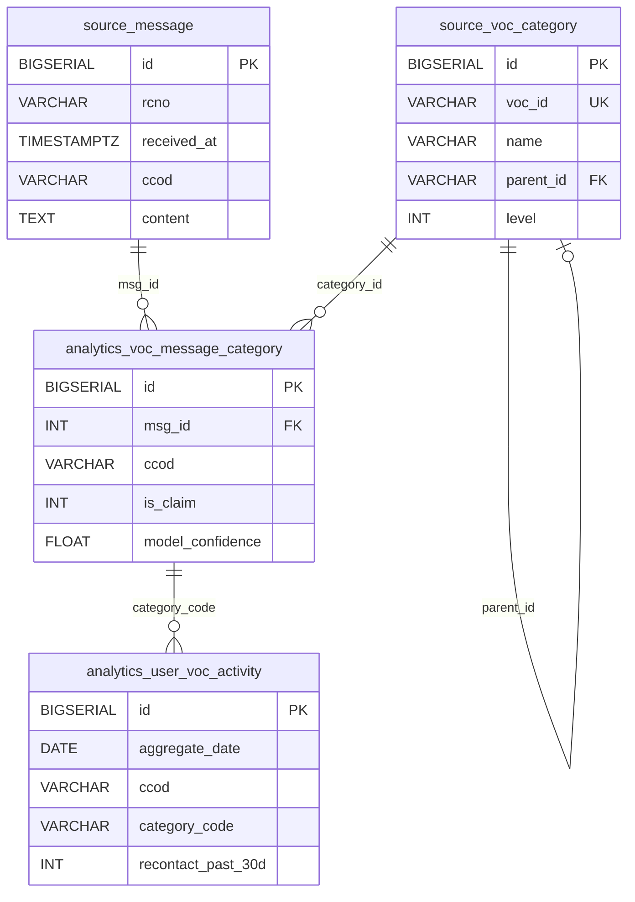

# VOC 분석 시스템 가이드

## 1. 용어 정의 (Terminology)

| 용어 | 정의 |
|------|------|
| VOC (Voice of Customer) | 고객이 접수한 불만, 문의, 요청 등 고객 접점 데이터를 의미합니다. |
| RCNO | 접수번호(Receipt Number)로, VOC를 고유하게 식별하는 값입니다. |
| CCOD | 고객코드(Customer Code)로, 고객을 고유하게 식별하는 값입니다. |
| 재인입 | 동일 고객이 동일 카테고리 (소분류 코드)로 VOC를 다시 제출하는 것을 의미합니다. |

**재인입 기간 정의:**

| 기간 | 범위 |
|------|------|
| 당일 (agg_day) | 당일 00:00부터 현재 추론 시점까지의 건수입니다. |
| 24시간 (past_24h) | 전일 00:00부터 현재 추론 시점까지의 건수입니다. |
| 3일 (past_3d) | 이틀 전 00:00부터 현재 추론 시점까지의 건수입니다. |
| 7일 (past_7d) | 6일 전 00:00부터 현재 추론 시점까지의 건수입니다. |
| 30일 (past_30d) | 29일 전 00:00부터 현재 추론 시점까지의 건수입니다. |

---

## 2. ERD (Entity Relationship Diagram)

VOC 분석 시스템은 4개의 테이블로 구성됩니다.

```
┌─────────────────────┐         ┌─────────────────────────────┐
│  source.message     │         │  source.voc_category        │
│  (VOC 원본 메시지)     │         │  (카테고리 분류 체계)           │
├─────────────────────┤         ├─────────────────────────────┤
│ PK: id              │         │ PK: id                      │
│     rcno            │         │ UK: voc_id (카테고리 코드)     │
│     ccod            │         │     name                    │
│     content         │         │ FK: parent_id (자기참조)     │
│     received_at     │         │     level (1=대,2=중,3=소)   │
└─────────┬───────────┘         └──────────────┬──────────────┘
          │                                    │
          │ msg_id (FK)                        │ category_id (FK)
          ▼                                    ▼
┌──────────────────────────────────────────────────────────────┐
│              analytics.voc_message_category                   │
│              (sLLM 분류 결과)                                  │
├──────────────────────────────────────────────────────────────┤
│ PK: id                                                        │
│ FK: msg_id → source.message.id                               │
│     ccod, rcno, content, msg_received_at                     │
│     model_name, model_ver, model_confidence                  │
│     is_claim, summary, keywords, bug_type                    │
│     main_category_1~5_*, sub_category_1~5_*, detail_category_1~5_* │
└──────────────────────────────┬───────────────────────────────┘
                               │
                               │ category_code (참조)
                               ▼
┌──────────────────────────────────────────────────────────────┐
│              analytics.user_voc_activity                      │
│              (재인입 집계)                                     │
├──────────────────────────────────────────────────────────────┤
│ PK: id                                                        │
│ UK: (aggregate_date, ccod, category_code)                    │
│     category_name                                            │
│     recontact_agg_day, recontact_past_24h/3d/7d/30d          │
└──────────────────────────────────────────────────────────────┘
```

**Optional: Flowchart 시각화를 위한 Mermaid ERD (상세)**



---

## 3. 데이터 흐름도 (Model Lineage)

VOC 데이터는 4단계 파이프라인을 거쳐 처리됩니다.

```
┌─────────────────────────────────────────────────────────────────────────────┐
│                           VOC 분석 파이프라인                                   │
└─────────────────────────────────────────────────────────────────────────────┘

[원천 데이터]
    │
    │  RODB.CESCOEIS.dbo.TB_VOC_Master
    │  (RCNO, INDT, CTCD, CMMO)
    │
    ▼
┌─────────────────────────────────────┐
│ [1단계] 데이터 수집                  │
│ ingest_voc_data()                   │
│ - 최근 1시간 데이터 조회             │
│ - 컬럼 매핑 및 변환                  │
└─────────────────┬───────────────────┘
                  │
                  ▼
           source.message
                  │
                  ▼
┌─────────────────────────────────────┐
│ [2단계] sLLM 분류                    │
│ analyze_message_data()              │
│ - 텍스트 전처리                      │
│ - sLLM API 호출                     │
│ - 카테고리 매핑                      │
│ - TF-IDF Fallback (bug_type)        │
└─────────────────┬───────────────────┘
                  │
                  ▼
    analytics.voc_message_category
                  │
                  ▼
┌─────────────────────────────────────┐
│ [3단계] 재인입 집계                  │
│ aggregate_voc_activities()          │
│ - SQL 윈도우 함수                    │
│ - 시간 윈도우별 COUNT                │
└─────────────────┬───────────────────┘
                  │
                  ▼
┌─────────────────────────────────────┐
│ [4단계] 결과 저장                    │
│ store_aggregated_results()          │
│ - UPSERT (ON CONFLICT)              │
└─────────────────┬───────────────────┘
                  │
                  ▼
     analytics.user_voc_activity
```

---

### [1단계] 데이터 수집 (ingest_voc_data)

RODB의 TB_VOC_Master 테이블에서 최근 1시간 이내 접수된 VOC 데이터를 조회합니다.

| 원천 컬럼 (RODB) | 대상 컬럼 (PostgreSQL) | 설명 |
|-----------------|---------------------|------|
| RCNO | rcno | 접수번호입니다. |
| INDT | received_at | 접수일시 (INDT)를 기준으로 최근 1시간 이내 VoC를 수집합니다. |
| CTCD | ccod | 고객코드입니다. |
| CMMO | content | 접수내용(VOC 메시지 본문)입니다. |

조회된 데이터는 PostgreSQL의 `source.message` 테이블에 INSERT됩니다.

---

### [2단계] sLLM 분류 (analyze_message_data)

`source.message`에 저장된 각 메시지에 대해 VoCAnalyzer 클래스가 분류를 수행합니다.

처리 순서:
1. 텍스트 전처리: 특수문자를 제거하고 공백을 정규화합니다.
2. sLLM API 호출: 전처리된 텍스트와 카테고리 체계를 sLLM 서버로 전송합니다.
3. 카테고리 매핑: sLLM 응답을 `source.voc_category` 테이블과 매핑하여 ID와 코드를 조회합니다.
4. Fallback 처리: sLLM이 bug_type을 반환하지 않으면 TF-IDF 유사도로 해충 종류를 추출합니다.

분류 결과는 `analytics.voc_message_category` 테이블에 INSERT됩니다.

---

### [3단계] 재인입 집계 (aggregate_voc_activities)

SQL 윈도우 함수를 사용하여 고객별, 카테고리별 재인입 횟수를 계산합니다.

집계 로직:
- `source.message`와 `analytics.voc_message_category`를 JOIN합니다.
- 5개 소분류 카테고리(detail_category_1~5_code)를 UNNEST하여 행으로 확장합니다.
- PARTITION BY (ccod, category_id)로 그룹화하고 시간 윈도우별 COUNT를 계산합니다.
- 재인입 횟수는 (전체 인입 횟수 - 1)로 계산됩니다.

---

### [4단계] 결과 저장 (store_aggregated_results)

집계 결과를 `analytics.user_voc_activity` 테이블에 UPSERT합니다.

UPSERT 조건: `(aggregate_date, ccod, category_code)` 복합키가 중복되면 UPDATE, 없으면 INSERT합니다.

---

## 4. 엔티티(테이블) 상세 명세

VOC 분석에서 사용하는 테이블은 4개입니다.

### 4.1 source.message

VOC 원본 메시지를 저장하는 테이블입니다.

| 컬럼명 | 데이터 타입 | 길이 | Nullable | 기본값 | 설명 |
|--------|------------|------|----------|--------|------|
| id | BIGSERIAL | 8 | NO | auto | Primary Key입니다. |
| rcno | VARCHAR | 50 | YES | - | 접수번호입니다. |
| received_at | TIMESTAMPTZ | - | NO | INDT | VOC 수신일시입니다. |
| ccod | VARCHAR | 50 | YES | - | 고객코드입니다. |
| content | TEXT | - | YES | - | VOC 메시지 본문입니다. |
| created_at | TIMESTAMPTZ | - | NO | NOW() | 레코드 생성일시입니다. |
| updated_at | TIMESTAMPTZ | - | NO | NOW() | 레코드 수정일시입니다. |

---

### 4.2 source.voc_category

VOC 카테고리 분류 체계를 저장하는 테이블입니다. 자기참조 FK로 계층 구조(대/중/소분류)를 표현합니다.

| 컬럼명 | 데이터 타입 | 길이 | Nullable | 기본값 | 설명 |
|--------|------------|------|----------|--------|------|
| id | BIGSERIAL | 8 | NO | auto | Primary Key입니다. |
| voc_id | VARCHAR | 50 | NO | - | VOC 카테고리 고유 ID입니다. UNIQUE 제약이 있습니다. |
| name | VARCHAR | 255 | NO | - | 카테고리명입니다. |
| parent_id | VARCHAR | 50 | YES | - | 상위 카테고리의 voc_id입니다. FK로 자기참조합니다. |
| level | INTEGER | 4 | YES | - | 계층 레벨입니다. 1=대분류, 2=중분류, 3=소분류입니다. |
| created_at | TIMESTAMPTZ | - | NO | NOW() | 레코드 생성일시입니다. |
| updated_at | TIMESTAMPTZ | - | NO | NOW() | 레코드 수정일시입니다. |

```
cf. VOC 카테고리 Schema: source.voc_category 테이블
```

---

### 4.3 analytics.voc_message_category

sLLM이 분류한 VOC 메시지 분류 결과를 저장하는 테이블입니다. 하나의 메시지에 최대 5개의 카테고리를 할당할 수 있습니다.

**기본 정보 컬럼 (15개: 13개 feature + 로깅 컬럼 created_at, updated 2개)**

| 컬럼명 | 데이터 타입 | 길이 | Nullable | 기본값 | 설명 |
|--------|------------|------|----------|--------|------|
| id | BIGSERIAL | 8 | NO | auto | Primary Key입니다. |
| msg_id | INT | 4 | YES | - | source.message.id를 참조하는 FK입니다. |
| ccod | VARCHAR | 50 | YES | - | 고객코드입니다. |
| rcno | VARCHAR | 50 | YES | - | 접수번호입니다. |
| msg_received_at | TIMESTAMPTZ | - | YES | - | VOC 수신일시입니다. |
| model_name | VARCHAR | 50 | YES | - | 분류에 사용된 모델명입니다. 현재 "cesco_sLLM_Qwen_3"입니다. |
| model_ver | VARCHAR | 50 | YES | - | 모델 버전입니다. 현재 "1.0"입니다. |
| content | TEXT | - | YES | - | VOC 메시지 본문입니다. |
| is_claim | INT | 4 | YES | - | 클레임 여부입니다. 0=클레임 아님, 1=클레임입니다. |
| summary | TEXT | - | YES | - | sLLM이 생성한 요약문입니다. |
| keywords | JSONB | - | YES | - | sLLM이 추출한 키워드 배열입니다. JSON 형식으로 저장합니다. |
| bug_type | VARCHAR | 50 | YES | - | 해충 종류입니다. sLLM 미반환 시 TF-IDF로 추출합니다. |
| model_confidence | FLOAT | 8 | YES | - | 모델 신뢰도입니다. 0~1 범위입니다. |
| created_at | TIMESTAMPTZ | - | NO | NOW() | 레코드 생성일시입니다. |
| updated_at | TIMESTAMPTZ | - | NO | NOW() | 레코드 수정일시입니다. |

**카테고리 컬럼 (50개 = 5세트 × 10컬럼)**

| 컬럼명 | 데이터 타입 | 길이 | Nullable | 기본값 | 설명 |
|--------|------------|------|----------|--------|------|
| main_category_1_name | VARCHAR | 50 | YES | - | 대분류 1의 명칭입니다. |
| main_category_1_id | INT | 4 | YES | - | 대분류 1의 ID입니다. source.voc_category.id를 참조하는 FK입니다. |
| main_category_1_code | VARCHAR | 50 | YES | - | 대분류 1의 코드(voc_id)입니다. |
| sub_category_1_name | VARCHAR | 50 | YES | - | 중분류 1의 명칭입니다. |
| sub_category_1_id | INT | 4 | YES | - | 중분류 1의 ID입니다. source.voc_category.id를 참조하는 FK입니다. |
| sub_category_1_code | VARCHAR | 50 | YES | - | 중분류 1의 코드(voc_id)입니다. |
| detail_category_1_name | VARCHAR | 50 | YES | - | 소분류 1의 명칭입니다. |
| detail_category_1_id | INT | 4 | YES | - | 소분류 1의 ID입니다. source.voc_category.id를 참조하는 FK입니다. |
| detail_category_1_code | VARCHAR | 50 | YES | - | 소분류 1의 코드(voc_id)입니다. |
| detail_category_1_reason | TEXT | - | YES | - | sLLM이 소분류 1을 선택한 근거입니다. |
| main_category_2_name | VARCHAR | 50 | YES | - | 대분류 2의 명칭입니다. |
| main_category_2_id | INT | 4 | YES | - | 대분류 2의 ID입니다. source.voc_category.id를 참조하는 FK입니다. |
| main_category_2_code | VARCHAR | 50 | YES | - | 대분류 2의 코드(voc_id)입니다. |
| sub_category_2_name | VARCHAR | 50 | YES | - | 중분류 2의 명칭입니다. |
| sub_category_2_id | INT | 4 | YES | - | 중분류 2의 ID입니다. source.voc_category.id를 참조하는 FK입니다. |
| sub_category_2_code | VARCHAR | 50 | YES | - | 중분류 2의 코드(voc_id)입니다. |
| detail_category_2_name | VARCHAR | 50 | YES | - | 소분류 2의 명칭입니다. |
| detail_category_2_id | INT | 4 | YES | - | 소분류 2의 ID입니다. source.voc_category.id를 참조하는 FK입니다. |
| detail_category_2_code | VARCHAR | 50 | YES | - | 소분류 2의 코드(voc_id)입니다. |
| detail_category_2_reason | TEXT | - | YES | - | sLLM이 소분류 2를 선택한 근거입니다. |
| main_category_3_name | VARCHAR | 50 | YES | - | 대분류 3의 명칭입니다. |
| main_category_3_id | INT | 4 | YES | - | 대분류 3의 ID입니다. source.voc_category.id를 참조하는 FK입니다. |
| main_category_3_code | VARCHAR | 50 | YES | - | 대분류 3의 코드(voc_id)입니다. |
| sub_category_3_name | VARCHAR | 50 | YES | - | 중분류 3의 명칭입니다. |
| sub_category_3_id | INT | 4 | YES | - | 중분류 3의 ID입니다. source.voc_category.id를 참조하는 FK입니다. |
| sub_category_3_code | VARCHAR | 50 | YES | - | 중분류 3의 코드(voc_id)입니다. |
| detail_category_3_name | VARCHAR | 50 | YES | - | 소분류 3의 명칭입니다. |
| detail_category_3_id | INT | 4 | YES | - | 소분류 3의 ID입니다. source.voc_category.id를 참조하는 FK입니다. |
| detail_category_3_code | VARCHAR | 50 | YES | - | 소분류 3의 코드(voc_id)입니다. |
| detail_category_3_reason | TEXT | - | YES | - | sLLM이 소분류 3을 선택한 근거입니다. |
| main_category_4_name | VARCHAR | 50 | YES | - | 대분류 4의 명칭입니다. |
| main_category_4_id | INT | 4 | YES | - | 대분류 4의 ID입니다. source.voc_category.id를 참조하는 FK입니다. |
| main_category_4_code | VARCHAR | 50 | YES | - | 대분류 4의 코드(voc_id)입니다. |
| sub_category_4_name | VARCHAR | 50 | YES | - | 중분류 4의 명칭입니다. |
| sub_category_4_id | INT | 4 | YES | - | 중분류 4의 ID입니다. source.voc_category.id를 참조하는 FK입니다. |
| sub_category_4_code | VARCHAR | 50 | YES | - | 중분류 4의 코드(voc_id)입니다. |
| detail_category_4_name | VARCHAR | 50 | YES | - | 소분류 4의 명칭입니다. |
| detail_category_4_id | INT | 4 | YES | - | 소분류 4의 ID입니다. source.voc_category.id를 참조하는 FK입니다. |
| detail_category_4_code | VARCHAR | 50 | YES | - | 소분류 4의 코드(voc_id)입니다. |
| detail_category_4_reason | TEXT | - | YES | - | sLLM이 소분류 4를 선택한 근거입니다. |
| main_category_5_name | VARCHAR | 50 | YES | - | 대분류 5의 명칭입니다. |
| main_category_5_id | INT | 4 | YES | - | 대분류 5의 ID입니다. source.voc_category.id를 참조하는 FK입니다. |
| main_category_5_code | VARCHAR | 50 | YES | - | 대분류 5의 코드(voc_id)입니다. |
| sub_category_5_name | VARCHAR | 50 | YES | - | 중분류 5의 명칭입니다. |
| sub_category_5_id | INT | 4 | YES | - | 중분류 5의 ID입니다. source.voc_category.id를 참조하는 FK입니다. |
| sub_category_5_code | VARCHAR | 50 | YES | - | 중분류 5의 코드(voc_id)입니다. |
| detail_category_5_name | VARCHAR | 50 | YES | - | 소분류 5의 명칭입니다. |
| detail_category_5_id | INT | 4 | YES | - | 소분류 5의 ID입니다. source.voc_category.id를 참조하는 FK입니다. |
| detail_category_5_code | VARCHAR | 50 | YES | - | 소분류 5의 코드(voc_id)입니다. |
| detail_category_5_reason | TEXT | - | YES | - | sLLM이 소분류 5를 선택한 근거입니다. |

**총 컬럼 수**: 65개 (기본 15개 + 카테고리 50개)

---

### 4.4 analytics.user_voc_activity

고객별, 카테고리별 재인입 횟수를 집계한 테이블입니다.

| 컬럼명 | 데이터 타입 | 길이 | Nullable | 기본값 | 설명 |
|--------|------------|------|----------|--------|------|
| id | BIGSERIAL | 8 | NO | auto | Primary Key입니다. |
| aggregate_date | DATE | - | NO | - | 집계 기준일입니다. |
| ccod | VARCHAR | 50 | NO | - | 고객코드입니다. |
| category_code | VARCHAR | 50 | NO | - | VOC 카테고리 코드(소분류 voc_id)입니다. |
| category_name | VARCHAR | 255 | YES | - | VOC 카테고리명입니다. |
| recontact_agg_day | INT | 4 | NO | 0 | 당일 재인입 건수입니다. |
| recontact_past_24h | INT | 4 | NO | 0 | 전일부터 현재 시점 내 재인입 건수입니다. |
| recontact_past_3d | INT | 4 | NO | 0 | 3일 내 재인입 건수입니다. |
| recontact_past_7d | INT | 4 | NO | 0 | 7일 내 재인입 건수입니다. |
| recontact_past_30d | INT | 4 | NO | 0 | 30일 내 재인입 건수입니다. |
| created_at | TIMESTAMPTZ | - | NO | NOW() | 레코드 생성일시입니다. |
| updated_at | TIMESTAMPTZ | - | NO | NOW() | 레코드 수정일시입니다. |

**UNIQUE 제약**: (aggregate_date, ccod, category_code) 복합키로 중복을 방지합니다.

**인덱스**:
- idx_user_voc_activity_date: aggregate_date 컬럼에 생성됩니다.
- idx_user_voc_activity_ccod: ccod 컬럼에 생성됩니다.
- idx_user_voc_activity_category: category_code 컬럼에 생성됩니다.

---

## 5. 재인입 건 수 적재 결과  명세

| 컬럼명 | 데이터 타입 | 설명 | 계산 방식 |
|--------|------------|------|----------|
| recontact_agg_day | INT | 당일 재인입 건수입니다. | 당일 00:00부터 현재까지 동일 (ccod, category) 조합의 건수에서 1을 뺀 값입니다. |
| recontact_past_24h | INT | 24시간 재인입 건수입니다. | 전일 00:00부터 현재까지 동일 (ccod, category) 조합의 건수에서 1을 뺀 값입니다. |
| recontact_past_3d | INT | 3일 재인입 건수입니다. | 이틀 전 00:00부터 현재까지 동일 (ccod, category) 조합의 건수에서 1을 뺀 값입니다. |
| recontact_past_7d | INT | 7일 재인입 건수입니다. | 6일 전 00:00부터 현재까지 동일 (ccod, category) 조합의 건수에서 1을 뺀 값입니다. |
| recontact_past_30d | INT | 30일 재인입 건수입니다. | 29일 전 00:00부터 현재까지 동일 (ccod, category) 조합의 건수에서 1을 뺀 값입니다. |


---

## 6. 배치 스케줄 명세

| Flow 명 | Cron 표현식 | 실행 주기 | 시간대 |
|---------|------------|----------|--------|
| Analyze VoC Messages | `0 * * * *` | 매시간 정각 | Asia/Seoul |

**상세 스케줄**

| 항목 | 내용 |
|------|------|
| 실행 시점 | 매일 00:00, 01:00, 02:00, ..., 23:00에 실행됩니다. 하루 총 24회 실행됩니다. |
| 데이터 범위 | 직전 1시간 이내 접수된 VOC 데이터를 조회합니다. |
| 의존성 | sLLM API 서버가 가동 중이어야 합니다. |

**예상 소요 시간 (2025-12-01 기준)**
- Batch Processing 기준, 1개의 Worker가 1분 당 약 15개의 datapoint를 처리합니다.
- 1시간에 인입된 데이터 분포 기준, 1시간에 가장 많이 인입된 건 수가 620건 이었고, 이 기준 41분 가량 소요됩니다.

---

## 7. 코드 설명

### 7.1 주요 파일 위치

| 파일 경로 | 설명 |
|----------|------|
| `flows/analyze_voc_message/main.py` | VOC 분석 파이프라인을 정의합니다. Prefect Flow와 Task가 포함되어 있습니다. |
| `flows/analyze_voc_message/processor.py` | VoCAnalyzer 클래스를 정의합니다. sLLM API 호출과 카테고리 매핑 로직이 포함되어 있습니다. |
| `entities/analytics/voc_message_category.py` | VoCEventObject Pydantic 모델을 정의합니다. |
| `entities/analytics/user_voc_activity.py` | UserVocActivity Pydantic 모델을 정의합니다. |

### 7.2 파이프라인 함수 설명

| 함수명 | 파일:라인 | 역할 |
|--------|----------|------|
| `ingest_voc_data()` | main.py:22 | RODB에서 최근 1시간 VOC를 조회하고 source.message 테이블에 저장합니다. |
| `analyze_message_data()` | main.py:12 | VoCAnalyzer를 사용하여 각 메시지를 분류합니다. |
| `aggregate_voc_activities()` | main.py:204 | SQL 윈도우 함수로 재인입 횟수를 집계합니다. |
| `store_aggregated_results()` | main.py:118 | 집계 결과를 user_voc_activity 테이블에 UPSERT합니다. |
| `analyze_voc()` | main.py:306 | 전체 파이프라인을 실행하는 Prefect Flow입니다. |

### 7.3 VoCAnalyzer 클래스 주요 메서드

| 메서드명 | 파일:라인 | 역할 |
|---------|----------|------|
| `__init__()` | processor.py:11 | DB 연결, API URL, 해충 리스트, 카테고리 매핑을 초기화합니다. |
| `input_text_cleansing()` | processor.py:53 | 텍스트에서 특수문자를 제거하고 공백을 정규화합니다. |
| `build_input_categories()` | processor.py:74 | DB에서 voc_category를 조회하여 sLLM 입력용 JSON 구조를 생성합니다. |
| `normalize_category_name()` | processor.py:63 | 카테고리명을 표준화된 이름으로 매핑합니다. |
| `get_category_info()` | processor.py:156 | 카테고리명으로 ID와 코드를 조회합니다. 미매칭 시 '기타'로 폴백합니다. |
| `find_related_bug()` | processor.py:131 | TF-IDF 유사도로 해충 종류를 추출합니다. sLLM이 bug_type을 반환하지 않을 때 사용합니다. |
| `analyze_message()` | processor.py:201 | 단일 메시지를 분류하고 64개 컬럼의 결과 dict를 반환합니다. |

---

## 8. 디렉토리 구조

VOC 분석과 관련된 디렉토리 구조는 다음과 같습니다.

```
/data/cesco-deskroom
├── flows/
│   └── analyze_voc_message/
│       ├── main.py           # VOC 분석 파이프라인을 정의합니다.
│       └── processor.py      # VoCAnalyzer 클래스를 정의합니다.
├── entities/
│   ├── source/
│   │   ├── message.py        # source.message 엔티티를 정의합니다.
│   │   └── voc_category.py   # source.voc_category 엔티티를 정의합니다.
│   └── analytics/
│       ├── voc_message_category.py  # analytics.voc_message_category 엔티티를 정의합니다.
│       └── user_voc_activity.py     # analytics.user_voc_activity 엔티티를 정의합니다.
├── src/
│   ├── dataloader.py         # RODB 연결 클래스(CescoRodbConnection)를 정의합니다.
│   └── core/
│       └── db_utils.py       # PostgreSQL 연결 함수(get_engine)를 정의합니다.
├── deploy.py                 # Prefect Flow 배포 설정과 스케줄을 정의합니다.
└── init.sql                  # PostgreSQL 테이블 DDL을 정의합니다.
```
